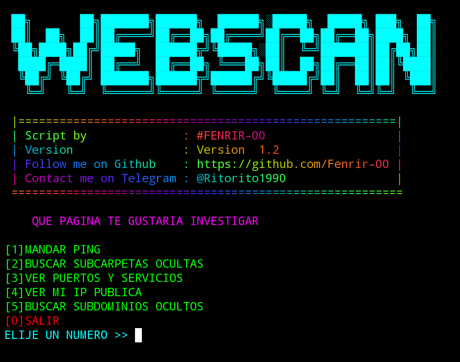

# instalación
``` bash
pkg install git
```
```bash
pkg install python
```
```bash
git clone https://github.com/Fenrir-00/investigar-web
```
```bash
cd investigar-web
```
```bash
python3 proyecto.py
```

# uso por comandos 

phyton proyecto.py -h
